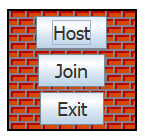
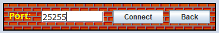
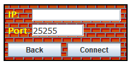
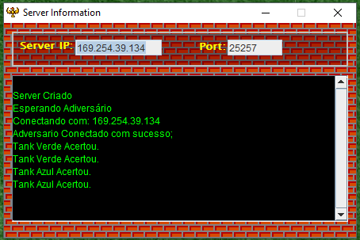
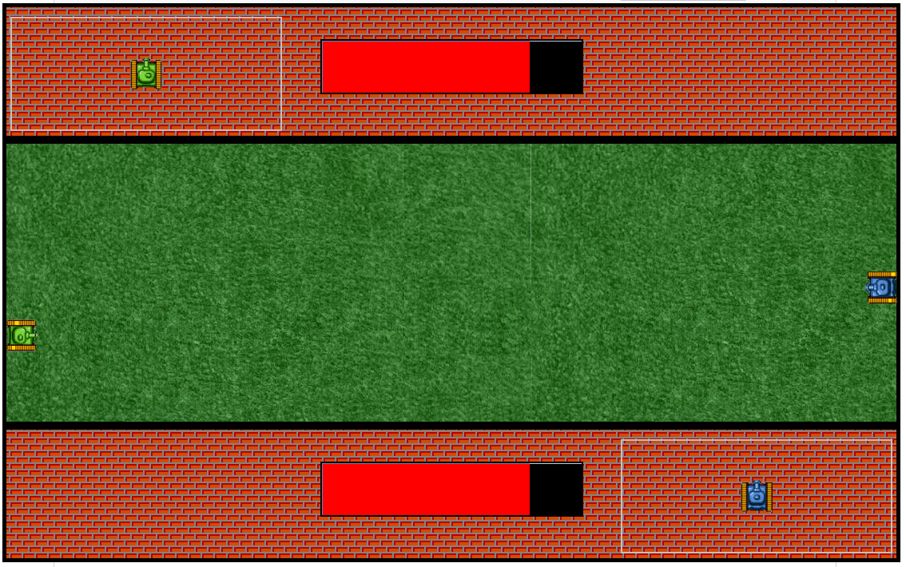

# This is a prototype of a multiplayer tank destroyer game on LAN network.

## Requirements

This prototype requires Java 7 onward.

## Introduction

<b>Shoot</b> is a prototype of a shoot and destroy game where you can play with another player in a LAN network by socket.

One of the players has to be the host of the match, and the other has to join the match. 

## Host

* To Create a server just click on HOST button.

* Then select the port you want to watch and wait for the other player.

## Join

* To join a server just click on JOIN button.

* Fill up the port and the IP of the server.

* Have fun!

